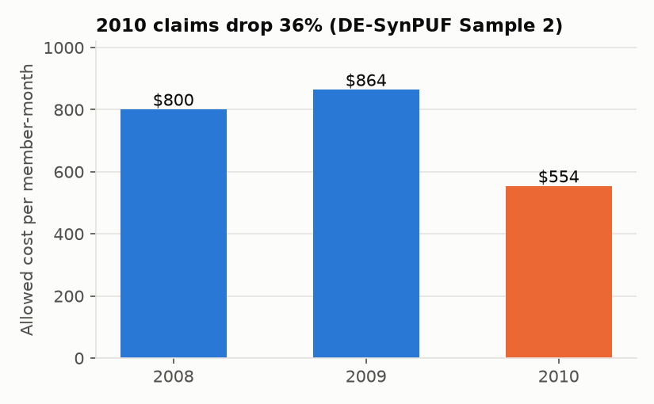
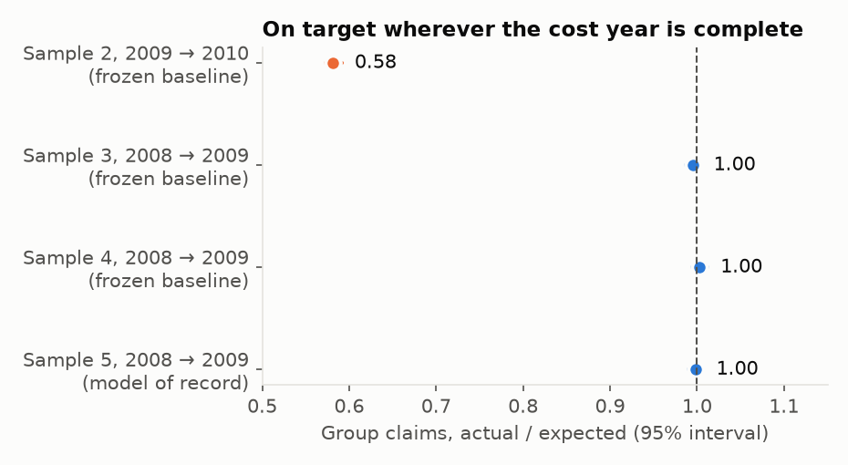
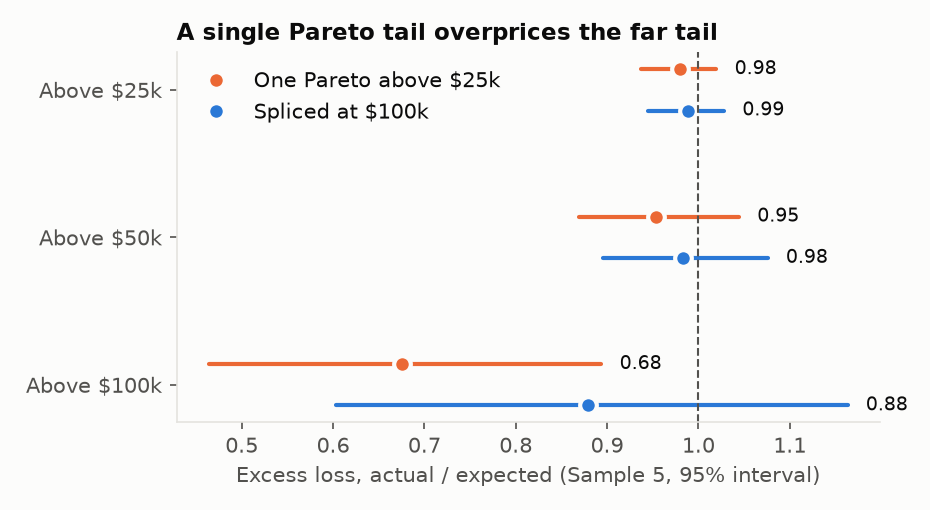
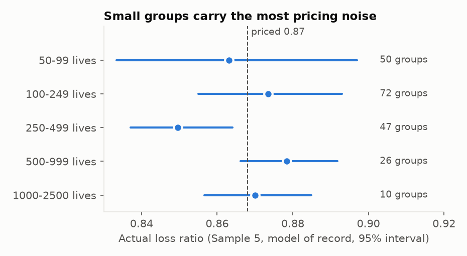

# Pricing stop-loss for employer groups from claims data

A self-funded employer pays its own health claims and buys stop-loss insurance against the bad
years: a **specific** layer that pays the part of any one member's annual cost above a deductible,
and an **aggregate** layer that pays when the whole group's claims run past an attachment point.
Pricing both comes down to two questions. What will this group cost next year? And how much of
that cost sits in the tail?

I built a pipeline that answers both from member-level medical and pharmacy claims, prices
synthetic employer groups, and then checks the price against what the groups cost the
following year. The first test missed on price level; four more rounds on new populations found
why and settled the model of record.

<!-- more -->

!!! abstract "TL;DR"
    - **Data:** CMS DE-SynPUF synthetic Medicare claims (inpatient, outpatient, professional and Part D), 2008–2010, five independent samples (Samples 2–6), cut into synthetic employer groups of 50–2,500 lives.
    - **Method:** point-in-time features with claims runout, a Tweedie GLM baseline against Tweedie LightGBM for next-year cost, high-cost-claimant probabilities at $25k / $50k / $100k, a generalized Pareto tail, and Monte Carlo pricing of specific and aggregate stop-loss per group.
    - **Result:** on populations no model had seen, group claims came in at **0.995–1.00 of expected** across ~205 groups per sample. The final configuration hit **0.999 [0.990–1.007]** on the last holdout.
    - **What the first test got wrong:** the out-of-time year (2010) came in at 0.58 of expected because DE-SynPUF's 2010 claims are 36% thinner than 2009's, a data artifact no pricing method could foresee.
    - **What changed along the way:** LightGBM replaced the GLM only after its gain replicated on a second unseen sample; a second Pareto segment above $100k fixed a 30% overstatement of far-tail losses; one level factor fixed LightGBM's 2% low bias; resampling actual-to-predicted ratios fixed a simulated spread of group totals that was 1.3× too wide and had the aggregate layer priced 4.5× too high.
    - **Stack:** Python, Kedro, LightGBM, DuckDB and Snowflake, dbt (reconciled row for row with the Python features), MLflow, uv. Code: [github.com/RonCom/group-underwriting](https://github.com/RonCom/group-underwriting).

!!! warning "Synthetic Medicare data, synthetic employers"
    DE-SynPUF is synthetic: CMS warns it doesn't preserve all relationships between variables.
    Its members are 65+ or disabled, so these "employer groups" are an age-skewed proxy for a
    working population. The dollar figures are Medicare-level and don't transfer to an employer
    book; the tests of whether prices match outcomes do.

## The problem in pricing terms

For a group *g* with a specific deductible *d*, the pieces are:

- **Expected claims:** the sum over members of predicted next-year cost.
- **Expected specific losses:** the sum over members of E[(cost − *d*)⁺], the part of each member's
  cost above the deductible.
- **Expected aggregate losses:** E[(net claims − attachment)⁺], where net claims are capped at the
  deductible per member and the attachment is 125% of expected net claims.

## Design choice 1: features as of a pricing date, with runout

An underwriter pricing a renewal sees claims *incurred* through the cutoff, but only those already
*paid*. Claims keep arriving for months afterwards. Training on fully paid history and scoring on
partly paid history would make every prediction look cheaper than it should.

So every feature is built as of December 31 of the feature year, from claims incurred that year
and paid within three months of the cutoff, the same rule in training and scoring. DE-SynPUF has no
paid date, so I simulated one per claim from a lag distribution by claim type. The same paid
dates feed a monthly development triangle for a chain-ladder IBNR estimate. Since I chose the lags,
the IBNR results test the chain-ladder code against those lags and say nothing about Medicare
payment speed.

The 32 features: age, sex, chronic-condition flags, enrollment months, cost by setting,
second-half cost, the largest claim, visit and fill counts. Race is in the data and left out of
pricing.

## Design choice 2: out of time, and out of population

Members are split in half by a hash of their ID. The model trains on one half (2008 features →
2009 cost) and is tested on the other half one year later (2009 features → 2010 cost). No member
and no group appears on both sides.

Employer groups don't exist in Medicare data, so I built them: within each half, members are
sorted by state and county and cut into blocks whose sizes are drawn from five bands (50–99 up to
1,000–2,500 lives). Groups end up geographically local, as employers' workforces are.

Cost models predict an annualized rate with exposure (enrolled months) as the weight, under a
Tweedie loss, which handles the large share of members with little or no cost and the long right
tail at once. Every interval in this post is a bootstrap that resamples **members** for member
metrics and **groups** for group metrics, never rows.

## Design choice 3: write the predictions down first

The same rule as in my [Medicare provider project](medicare-fwa.md): before each test, I committed
predictions and adoption rules to the repository. A challenger replaces the frozen baseline only if
its gain clears zero; every miss gets reported. Five rounds, five pre-registrations:

| Round | Data | Predictions hit |
|---|---|---|
| 1. Main test | Sample 2, 2009 → 2010 | 6 of 13 |
| 2. Follow-up | Sample 3 (new members), 2008 → 2009 | 10 of 12 |
| 3. Re-test | Sample 4, 2008 → 2009 | 8 of 9 |
| 4. Holdout | Sample 5, 2008 → 2009 | 6 of 7 |
| 5. Aggregate layer | Sample 6, 2008 → 2009 | 5 of 5 |

## Round 1: ranking works, level misses

The signal check came back far stronger than I predicted. On 2008 → 2009, prior-year cost alone
ranked next-year cost with a Gini of **0.64**; the GLM and LightGBM reached **0.69** and **0.71**.
I had predicted 0.10–0.35, given CMS's warning about the synthetic data. High-cost claimant AUCs
landed in the predicted range (0.74 at $25k, 0.71 at $50k).

Pricing missed. Group claims came in at **0.58 of expected**, with every size band between 0.56
and 0.62. Specific losses came in at 0.32 of expected.

The cause is in the data:

Every claim type falls 30–41% from 2009 to 2010, with claim counts falling the same way (inpatient
stays per 1,000 member-months: 28.8 → 17.1) while enrollment doesn't move. Nothing visible at the
pricing date predicts it: the 2008 → 2009 trend was 0.985. Any method priced on 2009 levels would
show the same miss. The pre-registration counts it as a miss anyway, and so do I.

LightGBM didn't earn adoption either. It ranked slightly better (Gini +0.012, interval clear of
zero), but its MAE gain interval crossed zero (−$40 to +$0.28), and the rule needed both.

## Round 2: test the level where the years are complete

DE-SynPUF stops in 2010, and no other free claims source covers later years. CMS does publish 20
independent samples, so the next test used new members on complete years. I froze the Sample 2
models, wrote down new predictions, and only then downloaded Sample 3: 72,271 members, none of
them in Sample 2, 207 groups, scored 2008 → 2009.

Group claims came in at **0.995 [0.987–1.004]** of expected, with every size band's interval
covering 1. Specific losses: 0.94 [0.85–1.03]. Aggregate attachments breached: 2, against 2.8
expected. The same result held on Samples 4 and 5:

Two things looked off. LightGBM beat the GLM on both MAE and Gini on Sample 3, which would have met
the adoption rule had the rule not already been spent. And losses above $100k came in at **0.59**
of expected: the tail was too heavy far out.

## Round 3: one change at a time

Both findings became pre-registered challengers on Sample 4, each tested alone against the frozen
baseline.

**LightGBM** repeated its gain on a second unseen sample (Gini +0.012 [0.010–0.014], MAE −$222
[−237 to −208]) and became the cost model of record. For the high-cost claimant models, its AUC gain
at $50k didn't clear zero, so logistic regression stayed.

**The tail.** A single generalized Pareto distribution above $25k had a positive shape
(ξ = 0.11). Fitting a second one above $100k, on claimants from data already seen (113 members
above $100k), gave a *negative* shape (ξ = −0.09): a bounded tail. Very large annual costs thin out
faster than the $25k fit implies. Splicing the two at $100k brought expected excess in line at all
three attachments:

The figure is from the final holdout (Sample 5), where the single tail came in at 0.68 above
$100k and the spliced tail at 0.88, with an interval covering 1 for the second time.

## Round 4: fix the level, then hold out once more

LightGBM ranked better but ran about 2% low on level (predicted / actual 0.986 and 0.978 on
Samples 3 and 4). A Tweedie GBM with early stopping doesn't guarantee its predictions sum to the
actuals. The fix is one multiplicative factor, total actual / total predicted, estimated on the
already-seen Samples 3 and 4: **1.018**.

On Sample 5 (72,116 members, none seen before), LightGBM's predicted / actual moved from 0.984 to
**1.002**, and group claims actual / expected from 1.017 to **0.999 [0.990–1.007]**. The model of
record is now recalibrated LightGBM for cost, logistic regression for claimants and the spliced
Pareto tail.

The one miss: groups of 250–499 lives came in 2% below expected with every configuration. I
don't know why yet.

## Round 5: the aggregate layer

Aggregate attachments were breached at or below the expected rate on Samples 3, 4 and 5 (pooled:
4 observed against 7.6 expected). Breaches are too rare to test directly, so I tested the whole
simulated distribution of each group's net claims instead. For each group, the PIT value is the
share of its simulated net claims below its actual net claims. If the simulation has the right
spread, PIT values are uniform across groups, with variance 1/12 = 0.083; a spread that's too wide
pushes them toward 0.5 and the variance down.

The Tweedie simulation gave PIT variances of 0.058–0.066 on the three seen samples: its spread was
about 1.3× too wide, because its dispersion came from uncapped costs. The challenger draws each
member's cost as predicted cost × an actual-to-predicted ratio resampled from already-seen members
in the same tenth of predicted cost. I wrote down five predictions and ran both on Sample 6
(72,216 new members, 206 groups):

| Member-cost simulation | PIT variance | Mean squared z (target 1) | Expected aggregate cost PMPM |
|---|---|---|---|
| Tweedie | 0.060 [0.052–0.067] | 0.58 [0.48–0.71] | $0.109 |
| Resampled ratios | 0.083 [0.072–0.091] | 0.95 [0.79–1.14] | $0.024 |

All five predictions hit, and the resampled ratios replaced Tweedie. The aggregate layer's
expected cost drops 78%: with a 125% corridor, a breach needs net claims 25% above expected, and
the narrower distribution puts less probability there.

## Small groups have the widest loss-ratio swings

A few large claimants move a 60-life group's loss ratio much more than a 2,000-life group's:

The 50–99 band's interval is 2.3–3.5× as wide as the 1,000+ band's on Samples 3–5, and 5.5× as
wide on Sample 2. A lower specific deductible caps how much of that swing the employer keeps, so
the deductible here steps from $25k for 50–99 lives to $100k for 500+.

## Explaining a group's price

SHAP values from the cost model are on the log scale, so a group's average contribution for a
feature, relative to the average group, is a multiplicative effect on its expected cost. That turns
into sentences an underwriter can check:

> Group TE0037, 1.34× an average group: professional claims 22.0 vs 17.7 per member (raises cost
> 15%); prior second-half cost $5,722 vs $3,435 (raises cost 5%); prior total cost $10,128 vs
> $6,996 (raises cost 3%).

Utilization carries the model: professional (carrier) claim counts, recent cost and total prior
cost, ahead of any single chronic condition.

## Engineering

- **Kedro pipelines:** ingest → features → models → tail → pricing → reporting, plus runout (IBNR)
  and one environment per pre-registered round, so each round reruns with one command and its
  frozen inputs are explicit in config.
- **dbt on DuckDB, reconciled row for row:** the same features rebuilt in SQL from the raw CSVs
  match the Python features on all 68,829 member-years and 33 columns. The same dbt models
  build in Snowflake from the same raw files, and Snowflake matches DuckDB row for row.
- **MLflow** tracks runs and registers the cost model; **Evidently** reports feature drift between
  scoring years; **uv** locks dependencies.
- **A synthetic-data mode** generates DE-SynPUF-shaped files and runs the whole pipeline offline in
  about 45 seconds, which is what CI runs.

## Limits

- **Synthetic claims, synthetic employers.** DE-SynPUF is a synthetic Medicare population, and I
  built the groups. Group-level correlation comes only from geography.
- **No plan design.** Allowed cost only: no employee cost sharing, network discounts, lasers, or
  run-in / run-out contract terms.
- **Paid dates are simulated,** so the runout and IBNR results test the chain-ladder method
  against lags I chose. The estimate missed its ±10% target (+11% and +21%). Separate triangles
  by claim type cut the error but still missed the target on a fresh sample (+15.7%).
- **Independent groups.** The simulation draws members independently within a group, so it
  can't represent correlated claims (an outbreak, a plant closure) that real employers have.
- **2010 is unusable for levels** in DE-SynPUF, so the out-of-time test only checks ranking; the
  level tests are same-period tests on independent populations.
