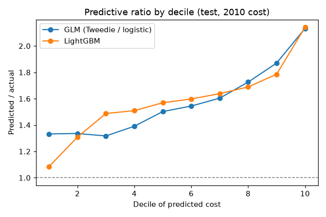
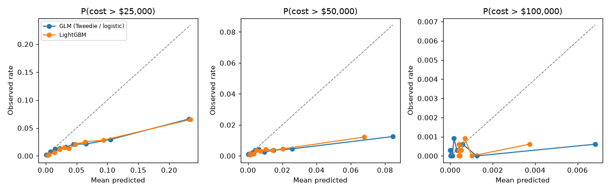
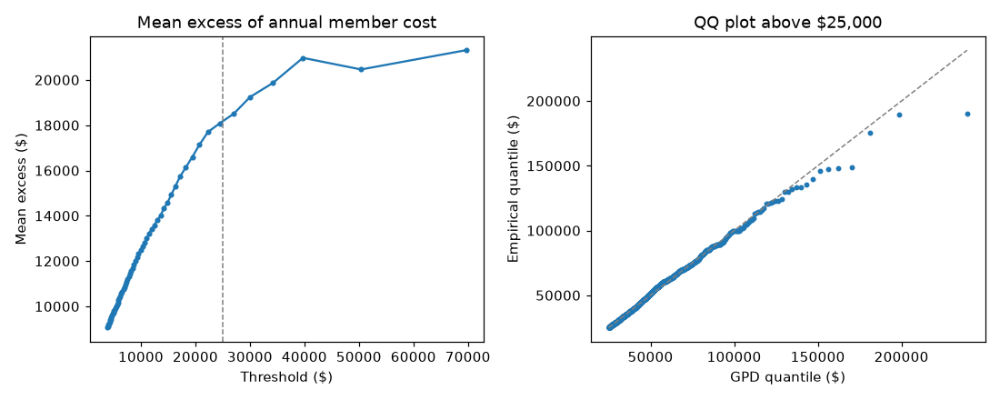
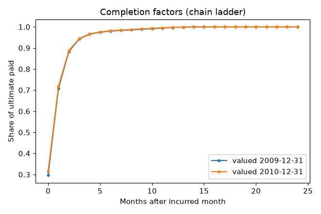
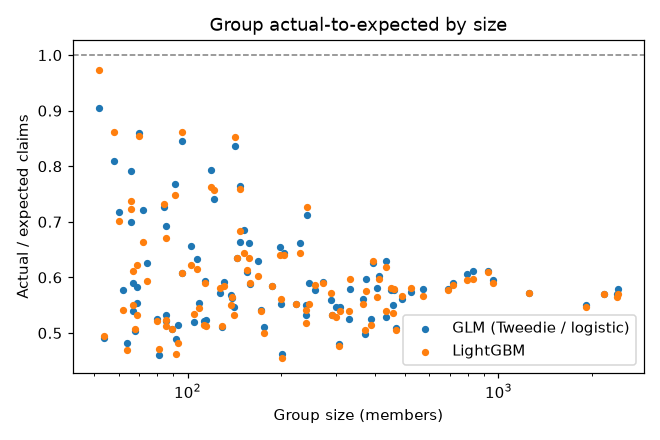
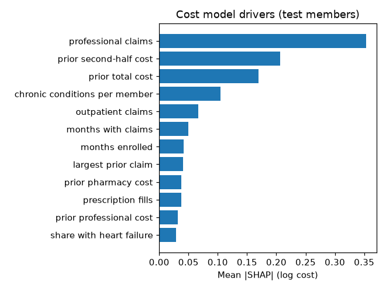

# Results (real data)

Generated 2026-10-05 by `kedro run`. Do not edit by hand.

Training: 35,996 members, features 2008 -> cost 2009. Test: 32,833 different members in 101 synthetic groups, features 2009 -> cost 2010. Intervals are 95% bootstrap intervals that resample members (member metrics) or groups (group metrics).

## Signal check (2008 -> 2009, inner validation members)

| Predictor | Gini |
|---|---|
| constant | 0.000 |
| prior_year_cost | 0.639 |
| glm | 0.693 |
| gbm | 0.708 |

Trend applied to test predictions (2008 -> 2009 PMPM at equal runout): 0.985.

## Member next-year cost (test)

| Model | MAE ($) | Gini | Predicted / actual |
|---|---|---|---|
| GLM (Tweedie / logistic) | 4,980 [4,912–5,044] | 0.540 [0.525–0.555] | 1.720 [1.688–1.749] |
| LightGBM | 4,960 [4,888–5,022] | 0.552 [0.538–0.566] | 1.734 [1.703–1.762] |
| LightGBM − GLM | -20 [-40–0] | 0.012 [0.009–0.015] | |

Predictive ratio (predicted / actual) by decile of predicted cost:

| Decile | GLM (Tweedie / logistic) | LightGBM |
|---|---|---|
| 1 | 1.33 | 1.08 |
| 2 | 1.34 | 1.31 |
| 3 | 1.32 | 1.49 |
| 4 | 1.39 | 1.51 |
| 5 | 1.50 | 1.57 |
| 6 | 1.54 | 1.60 |
| 7 | 1.60 | 1.64 |
| 8 | 1.73 | 1.69 |
| 9 | 1.87 | 1.79 |
| 10 | 2.13 | 2.14 |

## Group PMPM (test)

| Size band | Groups | Actual PMPM | GLM PMPM MAE | LightGBM PMPM MAE | LightGBM predicted / actual |
|---|---|---|---|---|---|
| 50-99 | 28 | 372 [341–403] | 223 [191–251] | 229 [194–260] | 1.616 [1.490–1.748] |
| 100-249 | 37 | 363 [344–381] | 236 [216–252] | 244 [223–262] | 1.674 [1.597–1.742] |
| 250-499 | 23 | 341 [328–354] | 269 [255–284] | 271 [257–287] | 1.795 [1.750–1.840] |
| 500-999 | 8 | 372 [356–388] | 253 [242–266] | 259 [247–271] | 1.695 [1.671–1.720] |
| 1000-2500 | 5 | 346 [337–355] | 262 [251–277] | 267 [254–282] | 1.772 [1.753–1.802] |
| All | 101 | 354 [347–363] | 255 [247–262] | 260 [252–268] | 1.734 [1.704–1.760] |

## High-cost claimants (test)

| Attachment | Claimants | Model | AUC | PR-AUC | Top-decile lift | Brier |
|---|---|---|---|---|---|---|
| $25,000 | 627 | LightGBM | 0.740 [0.722–0.761] | 0.116 [0.093–0.146] | 3.4 [3.1–3.8] | 0.0219 [0.0206–0.0232] |
| $25,000 | 627 | GLM (Tweedie / logistic) | 0.739 [0.721–0.759] | 0.099 [0.081–0.125] | 3.5 [3.1–3.8] | 0.0217 [0.0204–0.0229] |
| $50,000 | 118 | LightGBM | 0.718 [0.666–0.765] | 0.035 [0.019–0.066] | 3.4 [2.7–4.2] | 0.0046 [0.0040–0.0051] |
| $50,000 | 118 | GLM (Tweedie / logistic) | 0.711 [0.659–0.759] | 0.025 [0.015–0.047] | 3.5 [2.7–4.4] | 0.0044 [0.0039–0.0050] |
| $100,000 | 10 | LightGBM | 0.583 [0.391–0.794] | 0.002 [0.000–0.015] | 2.0 [0.0–5.0] | 0.0003 [0.0001–0.0005] |
| $100,000 | 10 | GLM (Tweedie / logistic) | 0.615 [0.415–0.793] | 0.003 [0.000–0.033] | 2.0 [0.0–5.0] | 0.0003 [0.0001–0.0005] |

AUC difference, LightGBM − GLM (paired, resampling members): $25,000: 0.001 [-0.004–0.008]; $50,000: 0.007 [-0.011–0.025]; $100,000: -0.031 [-0.142–0.086].

## Tail

Generalized Pareto above $25,000 on training members' 2009 cost: shape ξ = 0.107, scale σ = $16,295, 1831 exceedances (5.1% of members), KS p = 0.301 (the KS p-value ignores that the parameters were fit, so it is optimistic).

| Attachment | Claimants | HCC model | Expected excess / member | Actual excess / member | Actual / expected |
|---|---|---|---|---|---|
| $25,000 | 627 | LightGBM | $1,009 [$991–$1,026] | $295 [$259–$330] | 0.29 [0.26–0.33] |
| $25,000 | 627 | GLM (Tweedie / logistic) | $964 [$951–$978] | $295 [$259–$330] | 0.31 [0.27–0.34] |
| $50,000 | 118 | LightGBM | $284 [$279–$289] | $67 [$51–$84] | 0.24 [0.18–0.29] |
| $50,000 | 118 | GLM (Tweedie / logistic) | $271 [$267–$275] | $67 [$51–$84] | 0.25 [0.19–0.31] |
| $100,000 | 10 | LightGBM | $36 [$35–$36] | $4 [$1–$7] | 0.11 [0.03–0.21] |
| $100,000 | 10 | GLM (Tweedie / logistic) | $34 [$34–$35] | $4 [$1–$7] | 0.12 [0.03–0.22] |

## Claims runout (IBNR)

| Valuation | Paid to date | Estimated IBNR | Actual IBNR | Error |
|---|---|---|---|---|
| 2009-12-31 | $1,419,411,744 | $83,346,901 | $74,946,158 | +11.2% |
| 2010-12-31 | $1,176,414,298 | $23,841,882 | $19,722,488 | +20.9% |

## Stop-loss pricing by group size (test)

| Models | Size band | Groups | Members | Priced loss ratio | Actual loss ratio | Claims actual / expected | Specific actual / expected | Aggregate hits (expected) |
|---|---|---|---|---|---|---|---|---|
| GLM (Tweedie / logistic) | 50-99 | 28 | 2,095 | 0.868 | 0.542 [0.509–0.586] | 0.62 [0.59–0.67] | 0.53 [0.35–0.74] | 0 (1.0) |
| GLM (Tweedie / logistic) | 100-249 | 37 | 5,950 | 0.869 | 0.526 [0.504–0.551] | 0.61 [0.58–0.63] | 0.26 [0.12–0.45] | 0 (0.5) |
| GLM (Tweedie / logistic) | 250-499 | 23 | 8,608 | 0.870 | 0.486 [0.472–0.501] | 0.56 [0.54–0.58] | 0.24 [0.16–0.33] | 0 (0.0) |
| GLM (Tweedie / logistic) | 500-999 | 8 | 6,018 | 0.870 | 0.518 [0.508–0.526] | 0.60 [0.58–0.60] | 0.16 [0.00–0.38] | 0 (0.0) |
| GLM (Tweedie / logistic) | 1000-2500 | 5 | 10,162 | 0.870 | 0.494 [0.486–0.500] | 0.57 [0.56–0.58] | 0.00 [0.00–0.00] | 0 (0.0) |
| GLM (Tweedie / logistic) | All | 101 | 32,833 | 0.869 | 0.505 [0.498–0.514] | 0.58 [0.57–0.59] | 0.32 [0.23–0.41] | 0 (1.5) |
| LightGBM | 50-99 | 28 | 2,095 | 0.868 | 0.537 [0.502–0.582] | 0.62 [0.58–0.67] | 0.49 [0.32–0.68] | 0 (1.1) |
| LightGBM | 100-249 | 37 | 5,950 | 0.869 | 0.519 [0.497–0.545] | 0.60 [0.57–0.63] | 0.25 [0.12–0.43] | 0 (0.5) |
| LightGBM | 250-499 | 23 | 8,608 | 0.870 | 0.485 [0.471–0.499] | 0.56 [0.54–0.57] | 0.23 [0.16–0.32] | 0 (0.0) |
| LightGBM | 500-999 | 8 | 6,018 | 0.870 | 0.513 [0.506–0.520] | 0.59 [0.58–0.60] | 0.15 [0.00–0.36] | 0 (0.0) |
| LightGBM | 1000-2500 | 5 | 10,162 | 0.870 | 0.491 [0.483–0.496] | 0.56 [0.56–0.57] | 0.00 [0.00–0.00] | 0 (0.0) |
| LightGBM | All | 101 | 32,833 | 0.869 | 0.501 [0.494–0.510] | 0.58 [0.57–0.59] | 0.30 [0.22–0.39] | 0 (1.6) |

## Drivers

| Feature | Mean \|SHAP\| (cost) |
|---|---|
| professional claims | 0.353 |
| prior second-half cost | 0.207 |
| prior total cost | 0.169 |
| chronic conditions per member | 0.105 |
| outpatient claims | 0.066 |
| months with claims | 0.049 |
| months enrolled | 0.041 |
| largest prior claim | 0.041 |
| prior pharmacy cost | 0.038 |
| prescription fills | 0.037 |

Highest and lowest predicted-cost groups (cost relative to an average test group, top three drivers):

| Group | Relative cost | Drivers |
|---|---|---|
| TE0037 | 1.34× | professional claims 22.0 vs 17.7 (raises cost 15.1%); prior second-half cost $5,722 vs $3,435 (raises cost 4.9%); prior total cost $10,128 vs $6,996 (raises cost 2.9%) |
| TE0023 | 1.28× | professional claims 23.6 vs 17.7 (raises cost 12.1%); prior second-half cost $3,479 vs $3,435 (raises cost 4.5%); prior total cost $7,879 vs $6,996 (raises cost 3.1%) |
| TE0024 | 1.28× | professional claims 22.4 vs 17.7 (raises cost 13.6%); prior second-half cost $4,614 vs $3,435 (raises cost 3.9%); prior total cost $9,281 vs $6,996 (raises cost 2.5%) |
| TE0079 | 1.25× | professional claims 20.5 vs 17.7 (raises cost 9.1%); prior second-half cost $4,325 vs $3,435 (raises cost 5.8%); prior total cost $8,387 vs $6,996 (raises cost 3.7%) |
| TE0083 | 1.23× | professional claims 19.6 vs 17.7 (raises cost 8.8%); prior second-half cost $5,000 vs $3,435 (raises cost 4.6%); prior total cost $10,355 vs $6,996 (raises cost 3.8%) |
| TE0008 | 0.66× | professional claims 12.7 vs 17.7 (lowers cost 16.1%); prior second-half cost $2,143 vs $3,435 (lowers cost 9.2%); prior total cost $4,709 vs $6,996 (lowers cost 5.9%) |
| TE0048 | 0.65× | professional claims 14.1 vs 17.7 (lowers cost 13.9%); prior second-half cost $2,662 vs $3,435 (lowers cost 9.9%); prior total cost $5,526 vs $6,996 (lowers cost 6.6%) |
| TE0006 | 0.65× | professional claims 12.1 vs 17.7 (lowers cost 13.3%); prior second-half cost $2,515 vs $3,435 (lowers cost 11.1%); prior total cost $6,387 vs $6,996 (lowers cost 8.1%) |
| TE0007 | 0.64× | professional claims 13.9 vs 17.7 (lowers cost 13.5%); prior second-half cost $3,402 vs $3,435 (lowers cost 10.4%); prior total cost $5,443 vs $6,996 (lowers cost 7.3%) |
| TE0098 | 0.63× | professional claims 9.7 vs 17.7 (lowers cost 25.4%); chronic conditions per member 1.5 vs 2.8 (lowers cost 5.8%); prior second-half cost $2,308 vs $3,435 (lowers cost 4.9%) |

## Drift between scoring years (PSI, 2008 vs 2009 features)

| Feature | PSI | 2008 mean | 2009 mean |
|---|---|---|---|
| distinct drugs | 0.306 | 16.57 | 19.43 |
| prescription fills | 0.306 | 16.58 | 19.43 |
| prior pharmacy cost | 0.250 | 1,015.84 | 1,200.53 |
| months with Part D | 0.176 | 6.37 | 9.16 |
| months with claims | 0.169 | 8.84 | 10.01 |
| months enrolled | 0.107 | 11.10 | 11.76 |
| largest prior claim | 0.078 | 2,407.91 | 2,824.61 |
| outpatient claims | 0.070 | 2.64 | 3.05 |
