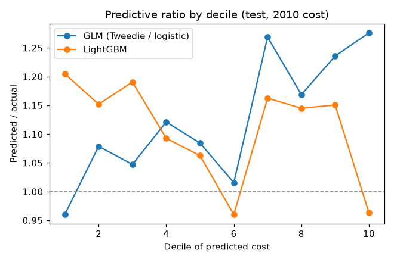
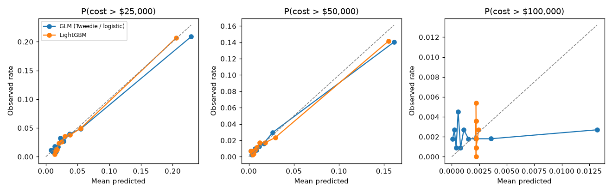
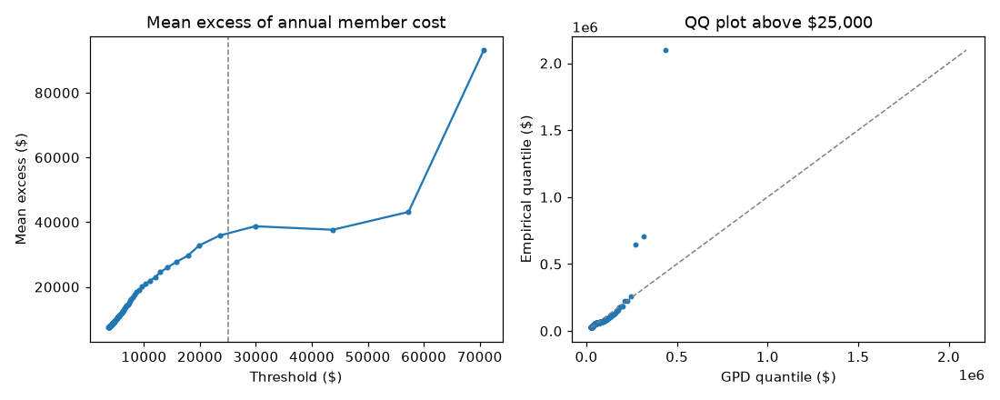
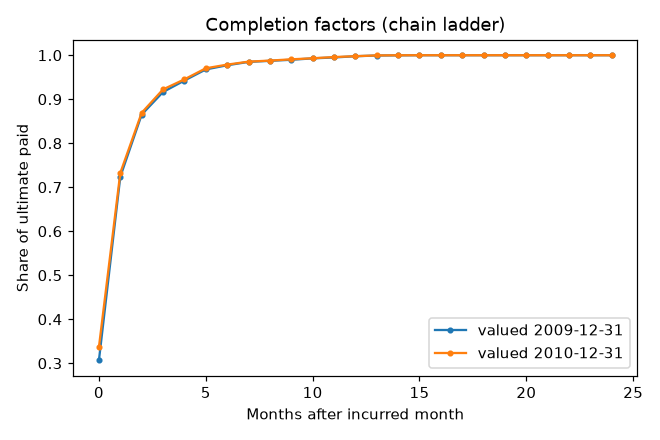
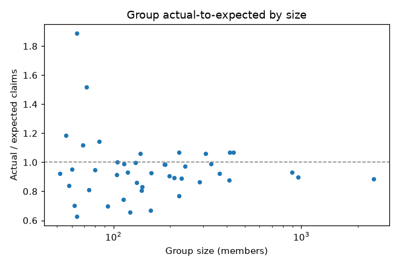
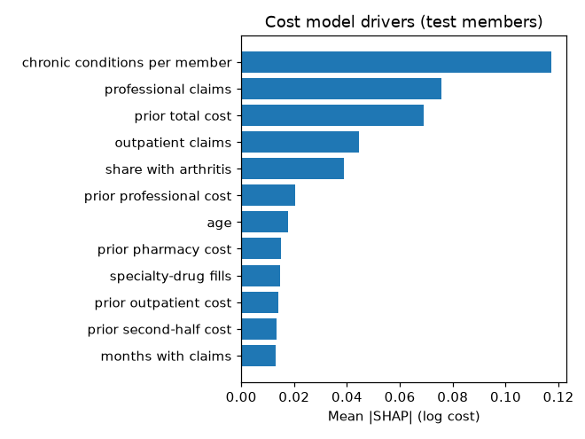

# Results (synthetic data)

Generated 2026-10-05 by `kedro run`. Do not edit by hand.

Training: 11,129 members, features 2008 -> cost 2009. Test: 11,104 different members in 44 synthetic groups, features 2009 -> cost 2010. Intervals are 95% bootstrap intervals that resample members (member metrics) or groups (group metrics).

## Signal check (2008 -> 2009, inner validation members)

| Predictor | Gini |
|---|---|
| constant | 0.000 |
| prior_year_cost | 0.358 |
| glm | 0.374 |
| gbm | 0.404 |

Trend applied to test predictions (2008 -> 2009 PMPM at equal runout): 1.145.

## Member next-year cost (test)

| Model | MAE ($) | Gini | Predicted / actual |
|---|---|---|---|
| GLM (Tweedie / logistic) | 5,088 [4,895–5,288] | 0.504 [0.456–0.545] | 1.164 [1.129–1.201] |
| LightGBM | 4,851 [4,646–5,052] | 0.526 [0.485–0.559] | 1.076 [1.045–1.112] |
| LightGBM − GLM | -237 [-292–-179] | 0.022 [0.009–0.039] | |

Predictive ratio (predicted / actual) by decile of predicted cost:

| Decile | GLM (Tweedie / logistic) | LightGBM |
|---|---|---|
| 1 | 0.96 | 1.20 |
| 2 | 1.08 | 1.15 |
| 3 | 1.05 | 1.19 |
| 4 | 1.12 | 1.09 |
| 5 | 1.08 | 1.06 |
| 6 | 1.02 | 0.96 |
| 7 | 1.27 | 1.16 |
| 8 | 1.17 | 1.14 |
| 9 | 1.24 | 1.15 |
| 10 | 1.28 | 0.96 |

## Group PMPM (test)

| Size band | Groups | Actual PMPM | GLM PMPM MAE | LightGBM PMPM MAE | LightGBM predicted / actual |
|---|---|---|---|---|---|
| 50-99 | 13 | 611 [507–753] | 159 [93–233] | 151 [91–222] | 0.979 [0.795–1.151] |
| 100-249 | 21 | 569 [532–595] | 108 [84–136] | 70 [49–96] | 1.107 [1.063–1.168] |
| 250-499 | 7 | 645 [585–693] | 80 [49–108] | 51 [34–70] | 1.016 [0.954–1.095] |
| 500-999 | 2 | 576 [567–585] | 96 [78–113] | 54 [45–63] | 1.094 [1.076–1.112] |
| 1000-2500 | 1 | 561 [561–561] | 126 [126–126] | 72 [72–72] | 1.129 [1.129–1.129] |
| All | 44 | 589 [570–618] | 107 [87–124] | 70 [60–84] | 1.076 [1.033–1.106] |

## High-cost claimants (test)

| Attachment | Claimants | Model | AUC | PR-AUC | Top-decile lift | Brier |
|---|---|---|---|---|---|---|
| $25,000 | 467 | LightGBM | 0.800 [0.779–0.825] | 0.431 [0.384–0.479] | 4.9 [4.5–5.4] | 0.0288 [0.0261–0.0317] |
| $25,000 | 467 | GLM (Tweedie / logistic) | 0.794 [0.766–0.820] | 0.442 [0.393–0.488] | 5.0 [4.5–5.4] | 0.0284 [0.0257–0.0314] |
| $50,000 | 265 | LightGBM | 0.831 [0.791–0.861] | 0.511 [0.444–0.579] | 5.9 [5.3–6.5] | 0.0131 [0.0111–0.0148] |
| $50,000 | 265 | GLM (Tweedie / logistic) | 0.836 [0.802–0.865] | 0.516 [0.452–0.578] | 5.9 [5.3–6.5] | 0.0132 [0.0111–0.0148] |
| $100,000 | 24 | LightGBM | 0.393 [0.271–0.494] | 0.002 [0.001–0.003] | 1.2 [0.0–2.1] | 0.0022 [0.0013–0.0031] |
| $100,000 | 24 | GLM (Tweedie / logistic) | 0.502 [0.383–0.631] | 0.004 [0.001–0.023] | 1.2 [0.0–2.7] | 0.0022 [0.0013–0.0031] |

## Tail

Generalized Pareto above $25,000 on training members' 2009 cost: shape ξ = 0.243, scale σ = $24,511, 407 exceedances (3.7% of members), KS p = 3.8e-05 (the KS p-value ignores that the parameters were fit, so it is optimistic).

| Attachment | Claimants | Expected excess / member | Actual excess / member | Actual / expected |
|---|---|---|---|---|
| $25,000 | 467 | $1,418 [$1,365–$1,475] | $1,300 [$1,110–$1,482] | 0.92 [0.80–1.04] |
| $50,000 | 265 | $711 [$685–$740] | $545 [$419–$687] | 0.77 [0.59–0.95] |
| $100,000 | 24 | $251 [$242–$261] | $149 [$70–$245] | 0.60 [0.28–0.97] |

## Claims runout (IBNR)

| Valuation | Paid to date | Estimated IBNR | Actual IBNR | Error |
|---|---|---|---|---|
| 2009-12-31 | $255,611,957 | $16,909,398 | $18,858,559 | -10.3% |
| 2010-12-31 | $286,907,754 | $17,791,877 | $18,047,540 | -1.4% |

## Stop-loss pricing by group size (test)

| Size band | Groups | Members | Priced loss ratio | Actual loss ratio | Claims actual / expected | Specific actual / expected | Aggregate hits (expected) |
|---|---|---|---|---|---|---|---|
| 50-99 | 13 | 888 | 0.845 | 0.863 [0.735–1.001] | 1.02 [0.87–1.19] | 1.22 [0.60–2.13] | 0 (2.5) |
| 100-249 | 21 | 3,384 | 0.859 | 0.776 [0.736–0.821] | 0.90 [0.86–0.96] | 0.72 [0.51–0.96] | 0 (2.4) |
| 250-499 | 7 | 2,560 | 0.868 | 0.854 [0.805–0.906] | 0.98 [0.93–1.04] | 0.91 [0.54–1.23] | 0 (0.2) |
| 500-999 | 2 | 1,856 | 0.869 | 0.794 [0.782–0.808] | 0.91 [0.90–0.93] | 0.24 [0.03–0.48] | 0 (0.0) |
| 1000-2500 | 1 | 2,416 | 0.870 | 0.770 [0.770–0.770] | 0.89 [0.89–0.89] | 0.50 [0.50–0.50] | 0 (0.0) |
| All | 44 | 11,104 | 0.864 | 0.803 [0.778–0.837] | 0.93 [0.90–0.97] | 0.81 [0.60–1.05] | 0 (5.2) |

## Drivers

| Feature | Mean \|SHAP\| (cost) |
|---|---|
| chronic conditions per member | 0.117 |
| professional claims | 0.076 |
| prior total cost | 0.069 |
| outpatient claims | 0.044 |
| share with arthritis | 0.039 |
| prior professional cost | 0.020 |
| age | 0.018 |
| prior pharmacy cost | 0.015 |
| specialty-drug fills | 0.015 |
| prior outpatient cost | 0.014 |

Highest and lowest predicted-cost groups (cost relative to an average test group, top three drivers):

| Group | Relative cost | Drivers |
|---|---|---|
| TE0018 | 1.09× | chronic conditions per member 2.1 vs 1.9 (raises cost 2.3%); prior total cost $7,759 vs $6,326 (raises cost 1.6%); specialty-drug fills 0.3 vs 0.1 (raises cost 1.2%) |
| TE0002 | 1.05× | specialty-drug fills 0.5 vs 0.1 (raises cost 2.4%); prior total cost $9,461 vs $6,326 (raises cost 1.8%); prior pharmacy cost $2,335 vs $1,036 (raises cost 0.8%) |
| TE0041 | 1.04× | chronic conditions per member 2.0 vs 1.9 (raises cost 0.9%); outpatient claims 4.9 vs 4.4 (raises cost 0.7%); professional claims 9.4 vs 9.1 (raises cost 0.6%) |
| TE0040 | 1.04× | chronic conditions per member 1.9 vs 1.9 (raises cost 2.1%); professional claims 9.4 vs 9.1 (raises cost 1.8%); outpatient claims 3.8 vs 4.4 (lowers cost 1.3%) |
| TE0007 | 1.03× | chronic conditions per member 2.0 vs 1.9 (raises cost 1.3%); prior outpatient cost $2,155 vs $1,856 (raises cost 0.6%); prior total cost $6,763 vs $6,326 (raises cost 0.6%) |
| TE0013 | 0.94× | professional claims 8.5 vs 9.1 (lowers cost 1.1%); specialty-drug fills 0.0 vs 0.1 (lowers cost 0.9%); prior total cost $5,945 vs $6,326 (lowers cost 0.8%) |
| TE0024 | 0.93× | chronic conditions per member 1.6 vs 1.9 (lowers cost 3.6%); professional claims 8.5 vs 9.1 (lowers cost 1.0%); prior total cost $5,246 vs $6,326 (lowers cost 0.8%) |
| TE0039 | 0.92× | prior total cost $4,574 vs $6,326 (lowers cost 2.0%); outpatient claims 3.5 vs 4.4 (lowers cost 1.4%); chronic conditions per member 1.6 vs 1.9 (lowers cost 1.4%) |
| TE0034 | 0.91× | chronic conditions per member 1.6 vs 1.9 (lowers cost 2.0%); prior total cost $4,899 vs $6,326 (lowers cost 1.6%); professional claims 8.2 vs 9.1 (lowers cost 1.5%) |
| TE0031 | 0.91× | prior total cost $4,628 vs $6,326 (lowers cost 2.1%); professional claims 8.2 vs 9.1 (lowers cost 1.7%); chronic conditions per member 1.7 vs 1.9 (lowers cost 1.2%) |

## Drift between scoring years (PSI, 2008 vs 2009 features)

| Feature | PSI | 2008 mean | 2009 mean |
|---|---|---|---|
| age | 0.055 | 70.17 | 71.06 |
| prior pharmacy cost | 0.012 | 664.47 | 1,035.67 |
| chronic conditions per member | 0.012 | 1.73 | 1.88 |
| prior total cost | 0.011 | 5,707.22 | 6,325.61 |
| prior second-half cost | 0.011 | 2,721.46 | 3,225.97 |
| prior professional cost | 0.009 | 1,726.76 | 1,816.08 |
| largest prior claim | 0.006 | 2,519.39 | 2,615.95 |
| prior outpatient cost | 0.005 | 1,723.67 | 1,855.63 |
